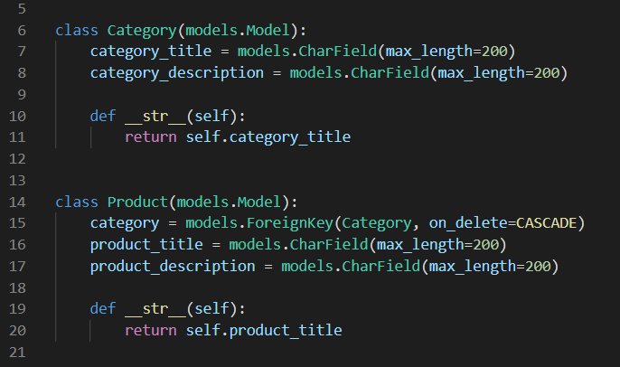

# Assignment

 
The search bar has a debouncing function for the input text, to avoid rapid calling

 
The tab display all the Cards with the same category

 
The django model looks like this. A foriegn key is used to link categories and products
