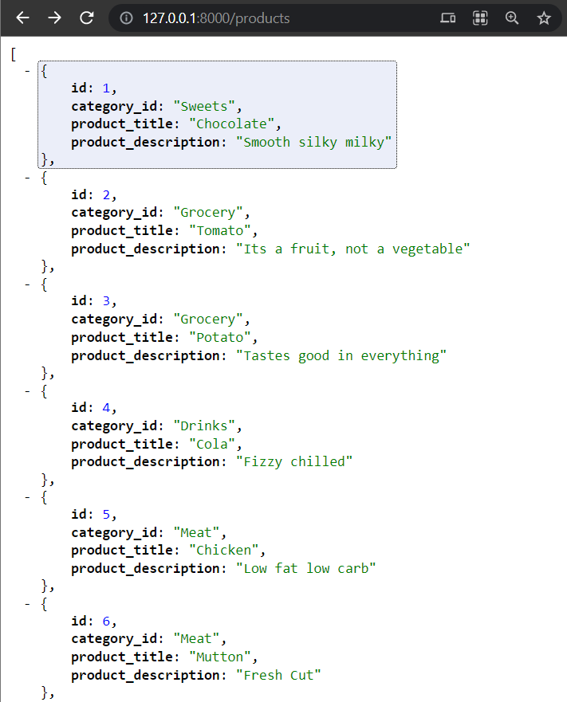

# Assignment

 
The search bar has a debouncing function for the input text, to avoid rapid calling   

 
The tab display all the Cards with the same category   

 
The django model looks like this. A foriegn key is used to link categories and products   

 
The models are hosted as json objects

 
The models are hosted as json objects
